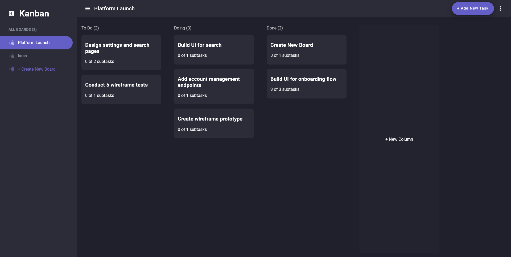
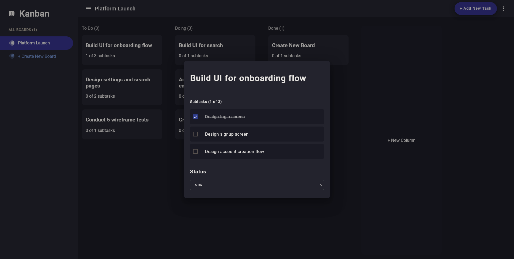

<div align="center">
    
    


### Kanban Board Application
🚀 This is a Kanban board application built with Angular. It allows users to create boards, add tasks to boards, and track the progress of tasks.

</div>

- [Overview](#features)
- [How To Use](#how-to-use)
- [Technologies](#technologies)
- [Code scaffolding](#code-scaffolding)
- [Build](#build)
- [Running unit tests](#running-unit-tests)
- [Running end-to-end tests](#running-end-to-end-tests)
- [Further help](#further-help)

## Features

- Create boards and tasks
- Mark tasks as complete
- Add subtasks to tasks

## How To Use
Visit the website https://kanbanangular.netlify.app

or

Clone and run this application, you'll need [Git](https://git-scm.com) and [Node.js](https://nodejs.org/en/download/) (which comes with [npm](http://npmjs.com)) installed on your computer. From your command line:

```bash
# Clone this repository
$ git clone https://github.com/LarsWeyen/angular-kanban-app.git

# Go into the repository
$ cd angular-kanban-app

# install dependencies
$ npm install

# Run the app
$ ng serve
```

## Technologies
This project was generated with [Angular CLI](https://github.com/angular/angular-cli) version 17.2.1.

- **Angular**
- **Angular CLI**
- **Material UI**

## Code scaffolding

Run `ng generate component component-name` to generate a new component. You can also use `ng generate directive|pipe|service|class|guard|interface|enum|module`.

## Build

Run `ng build` to build the project. The build artifacts will be stored in the `dist/` directory.

## Running unit tests

Run `ng test` to execute the unit tests via [Karma](https://karma-runner.github.io).

## Running end-to-end tests

Run `ng e2e` to execute the end-to-end tests via a platform of your choice. To use this command, you need to first add a package that implements end-to-end testing capabilities.

## Further help

To get more help on the Angular CLI use `ng help` or go check out the [Angular CLI Overview and Command Reference](https://angular.io/cli) page.

